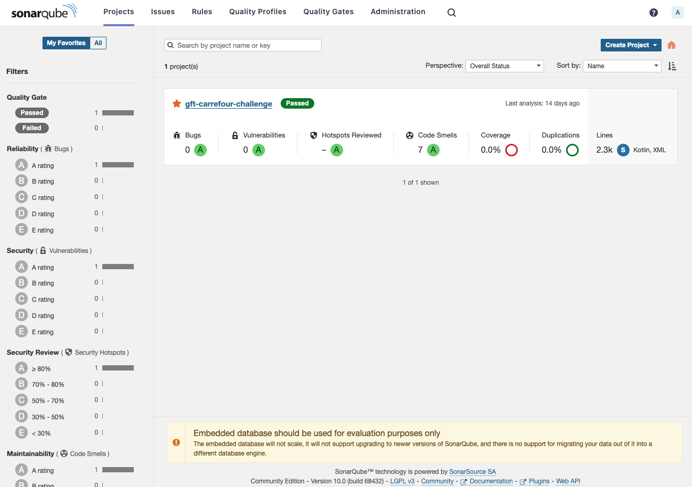
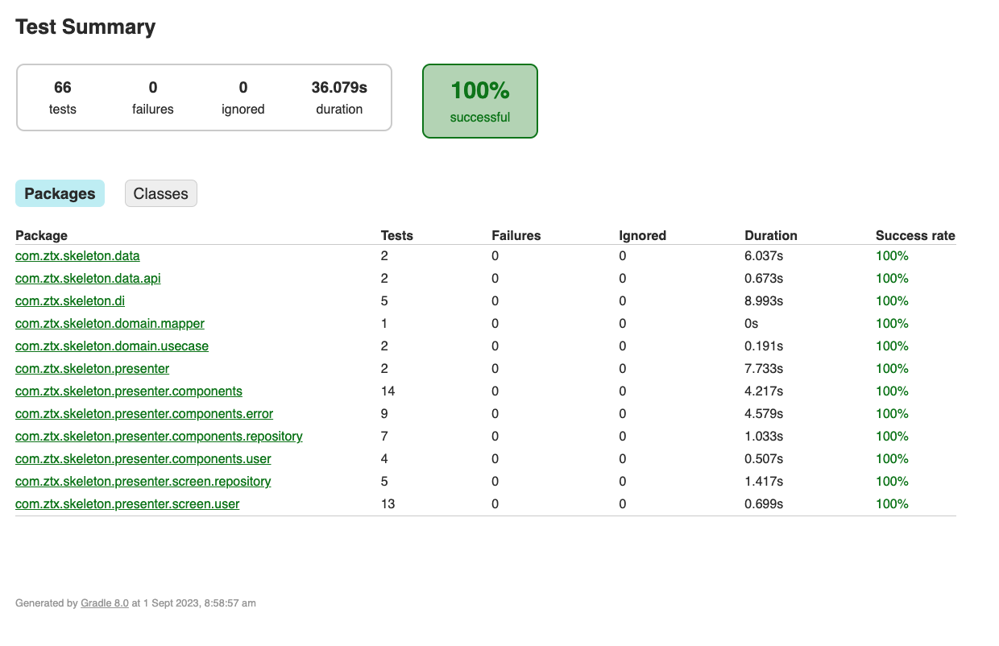
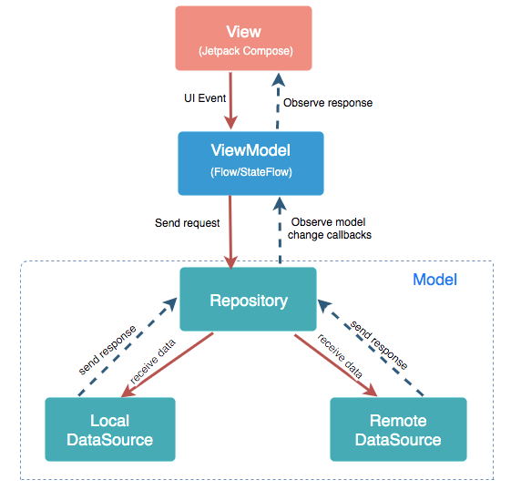
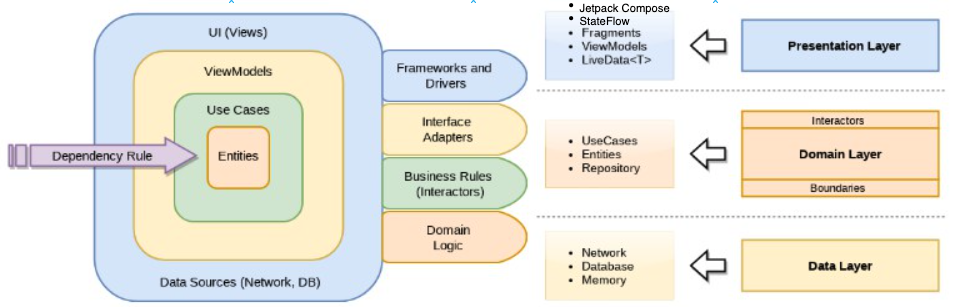

# Gft
## Technical Challenge
### Github app 
#### Regras Gerais

● O candidato tem até 3 dias para entregar a implementação do desafio.
● Nenhuma alteração no projeto será permitida após a entrega, caso contrário o
candidato será desclassificado.
● O projeto deve ser desenvolvido em Android navito
(Kotlin).
● O projeto deve ser disponibilizado em um repositório git (Github, Bitbucket ou
Gitlab) público.
● O projeto deve conter as instruções necessárias para realizar a execução do
mesmo.
● O candidato pode utilizar bibliotecas open-source de terceiros.

#### O Desafio

O desafio consiste na implementação de uma aplicação Android que deverá consumir a API
pública do Github, que disponibiliza informações sobre os usuários e seus repositórios, onde
o aplicativo deverá permitir a listagem de usuários, busca de usuário por nome de usuário e
visualização das informações de um usuário específico, bem como a listagem de seus
repositórios.

#### Descrição

A aplicação deverá consumir um serviço para realizar tais operações. Segue a URL
da API:

- [https://api.github.com](https://api.github.com)

● Para listar os usuários, a aplicação deverá consumir o seguinte endereço:

- [https://api.github.com/users](https://api.github.com/users)

Este endereço lista apenas alguns usuários. Isto pode servir como uma massa de dados para
a tela de listagem dos usuários da aplicação.

● Para obter informações específicas de um usuário, basta acessar o seguinte
endereço:

- [https://api.github.com/users/torvalds](https://api.github.com/users/torvalds)

● Para listar os repositórios de um usuário específico, a aplicação deverá acessar o
seguinte endereço:

- [https://api.github.com/users/torvalds/repos](https://api.github.com/users/torvalds/repos)

● Para obter mais informações sobre a API:

- [https://developer.github.com/v3/](https://developer.github.com/v3/)

#### Dicas

• É sempre bom avisar ao usuário quando uma operação está em andamento.
• A API pode retornar erros, por isso pense em como apresentar isso ao usuário.
• Faça testes automatizados.
• Explore a API antes de começar qualquer coisa.
• Tire um tempo para entender tudo e faça um planejamento. Um bom projeto é fruto de
um bom planejamento

### Good Practices
To develop this app some good practices were used, such as:
- TDD
- SOLID Principles
- OO Principles
- Clean Code
- Static Analyse of Code (SONARQUBE)

#### TechStack
- Jetpack Compose (Layout)
    - [Jetpack Compose: Official Documentation](https://developer.android.com/jetpack/compose?gclid=CjwKCAjwivemBhBhEiwAJxNWN6w06hL4i1TxZNyN0Zf8vQ_XBjIJ3tMequ55xLTz9NJSas7sXWrcnxoCFkwQAvD_BwE&gclsrc=aw.ds&hl=pt-br)
- Flow + StateFlow
    - [Flow + StateFlow: Official Documentation](https://developer.android.com/kotlin/flow?hl=pt-br)
- Coroutines (Multithreading)
    - [Coroutines: Official Documentation](https://developer.android.com/kotlin/coroutines?hl=pt-br)
- Junit + Robolectric + Mockk (Unit Tests)
- Hilt (Dependency injection)

### Code Quality
The code quality was measured using sonarqube and the report can be checked below:

### Unit Tests
The project contains a good coverage of tests, totalizing 98 and all of them are passing.

Below is possible to verify a preview about a unit test report:

### Architecture
The architecture chose for the project was **MVVM + Clean Architecture**
#### Benefits of MVVM:

1. **Separation of Concerns:** MVVM promotes a clear distinction between the logic of your application (ViewModel) and the UI (View). This makes the code more readable and easier to maintain.

2. **Data Binding:** MVVM is designed around the concept of data binding. This allows automatic UI updates when your data changes, leading to less boilerplate code.

3. **Testability:** With the separation between the UI and business logic, you can easily write unit tests for your ViewModel without needing to test the UI directly.

4. **Reusability:** ViewModel is not directly tied to a view, meaning you can reuse it across different parts of your application or even in other projects.

5. **Reduced Coupling:** The ViewModel doesn't have a direct reference to the View, leading to reduced coupling and more modular code.

#### Benefits of Clean Architecture:

1. **Independent of Frameworks:** Clean Architecture doesn't rely on the existence of some library of feature-laden software. This makes the architecture more adaptable and resilient to technology shifts.

2. **Testable:** Business rules can be tested without the UI, database, web server, or any external entity.

3. **Independent of UI:** The UI can change without changing the rest of the system. So, a web UI could be replaced with a console UI, for instance, with minimal changes to the system.

4. **Independent of Database:** You can swap out Oracle for SQL Server, MySQL, or any other database with minimal code changes.

5. **Independent of any external agency:** In other words, your business rules don't know anything at all about the outside world.

6. **Flexibility:** It allows for easier maintenance, scalability, and adaptability by following a modular approach.

#### Combining MVVM with Clean Architecture:
1. **Clear Layer Distinction:** Clean Architecture's concentric circle design combined with MVVM ensures a rigorous separation of concerns, making each layer focused on a specific purpose.

2. **Consistency:** MVVM's data-binding and reactive patterns combined with the principles of Clean Architecture lead to a consistent approach in data handling and UI updates.

3. **Scalability:** As your application grows, you can scale and maintain it more easily by following MVVM and Clean Architecture principles combined.

4. **Enhanced Testability:** Both architectures prioritize testability. When combined, you can achieve comprehensive test coverage, ensuring your UI, business logic, and data layers are thoroughly validated.

5. **Improved Collaboration:** Developers working on different layers can work simultaneously with minimal dependencies, improving team productivity.

### Interesting links
- [https://docs.github.com/pt/rest/guides/using-pagination-in-the-rest-api?apiVersion=2022-11-28](pagination)
- [https://docs.github.com/pt/free-pro-team@latest/rest/repos/repos?apiVersion=2022-11-28#list-organization-repositories](repositories scheme)
- [https://docs.github.com/pt/rest/overview/authenticating-to-the-rest-api?apiVersion=2022-11-28](authentication in github rest api)